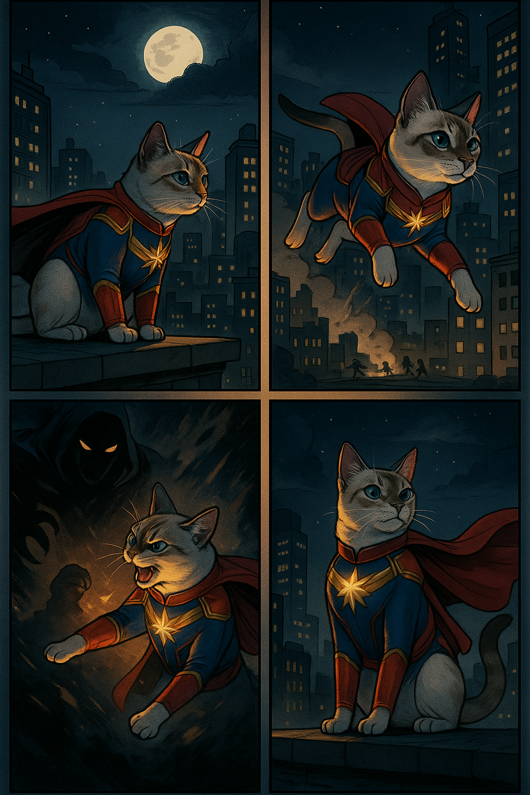

### Template

```markdown
# Nina - A guardiã das galáxias

## 📒 Descrição
Este projeto consiste na criação de uma ilustração digital no formato de história em quadrinhos (HQ) em uma única página A4, dividida em 4 quadrinhos, com estilo inspirado em comics clássicos de super-heróis.

O prompt utilizado para guiar a geração foi:

“Crie uma história em quadrinhos de 4 quadrinhos onde a Nina é a personagem principal. A Nina deve ter corpo de gato mesmo, e a roupinha dela deve ser inspirada em heróis da Marvel. O desenho deve ser estilo HQ. A história em quadrinhos deve estar toda na mesma página, A4, dividida em 4 partes. Não precisa ter falas, seja criativo.”

A IA interpretou o prompt e gerou uma imagem em alta qualidade com a Nina caracterizada como uma super-heroína felina com traje inspirado na Capitã Marvel, em um cenário noturno urbano. Os quadrinhos mostram sua postura heroica, a ação contra uma sombra ameaçadora e sua vitória final.

Este projeto demonstra o potencial criativo da IA generativa para transformar conceitos imaginativos em ilustrações visuais cativantes, seguindo instruções específicas de narrativa, estilo e formato.

## 🤖 Tecnologias Utilizadas
Foi utilizado o ChatGPT com capacidade de geração de imagens (GPT-4o com DALL·E), que possibilita a criação de ilustrações detalhadas a partir de descrições textuais (prompting).

## 🧐 Processo de Criação
O projeto começou com a ideia criativa de transformar a Nina, uma gata real com pelagem clara e olhos azuis marcantes, em protagonista de uma pequena história em quadrinhos com estética de HQ clássica de super-heróis.

1️⃣ Definição do conceito
O primeiro passo foi imaginar o tema e a ambientação: Nina como uma heroína felina no universo Marvel. A decisão foi mantê-la com corpo e postura de gato, mas vestida com um traje inspirado nos heróis da Marvel — especificamente algo próximo ao uniforme da Capitã Marvel, por suas cores vibrantes (vermelho, azul e dourado) e o ar de liderança e força que transmite.

O estilo da arte também foi definido já no conceito: HQ (história em quadrinhos), com a página dividida em 4 quadrinhos narrativos, sem necessidade de balões de fala, permitindo que a narrativa fosse visual e intuitiva.

2️⃣ Elaboração do prompt
O próximo passo foi redigir um prompt claro e detalhado para a IA generativa de imagens (ChatGPT com DALL·E integrado). O prompt descreveu:

A personagem principal (Nina, com corpo de gato real);

O traje inspirado em heróis da Marvel;

O formato (uma página A4, dividida em 4 quadrinhos);

O estilo artístico (HQ clássica de super-heróis);

A ausência de falas, para uma narrativa puramente visual.

Esse cuidado em definir os elementos essenciais garantiu que a IA compreendesse a direção criativa desejada.

3️⃣ Geração da imagem
Com o prompt enviado ao modelo GPT-4o com suporte a geração de imagens, a IA processou a instrução e criou a página A4 com os 4 quadrinhos, trazendo:

Cenário noturno urbano, típico de histórias de heróis;

A Nina em poses que transmitem coragem e ação (sentinela em um telhado, salto em direção ao perigo, enfrentamento do inimigo, e sua postura vitoriosa);

Paleta de cores coerente com quadrinhos clássicos: contrastes fortes e detalhes luminosos no uniforme.

4️⃣ Revisão e interpretação
Por fim, a imagem gerada foi analisada para verificar se todos os elementos essenciais estavam presentes: personagem bem caracterizada, traje inspirado na Marvel, narrativa implícita em 4 quadros, estética de HQ. O resultado atendeu às expectativas e ficou pronto para ser usado ou impresso como uma pequena obra visual.

✨ Resumo:
O processo de criação combinou criatividade humana (na concepção e no detalhamento do prompt) com a capacidade técnica da IA generativa para transformar a ideia em uma obra visual consistente, respeitando estilo, formato e narrativa.

## 🚀 Resultados




